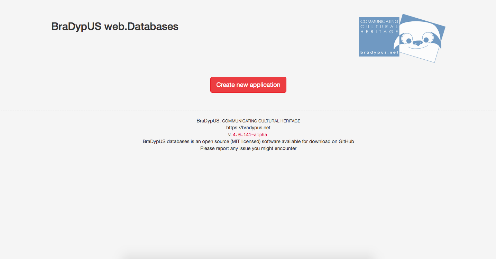
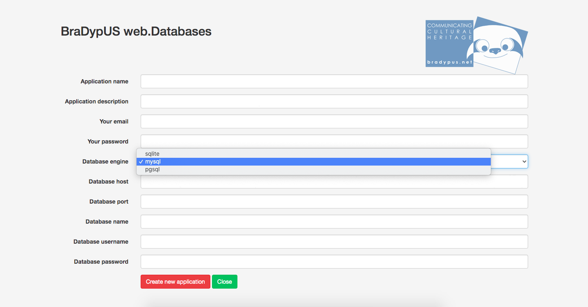
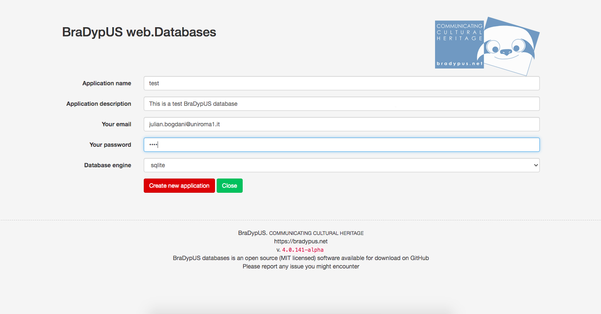
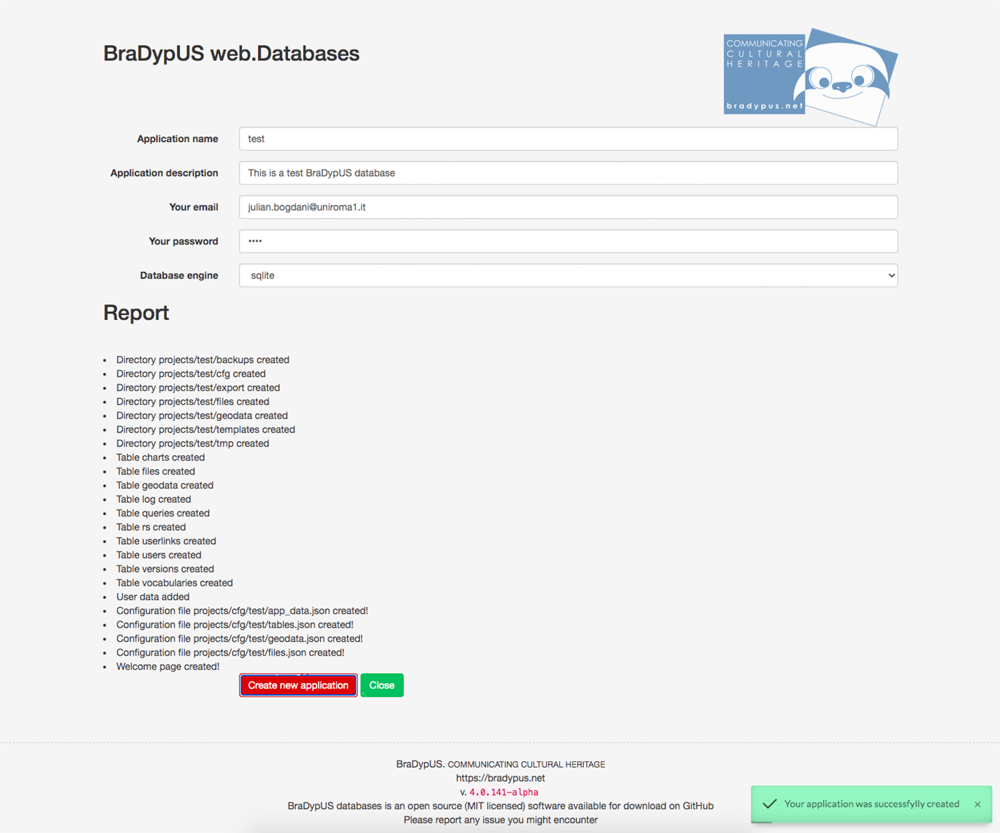

# Creating a new application

Since version 4, the creation of a new BraDypUS application can
be made via graphical user interface and no further need of coding.

Hopefully this will be an important step towards a broader diffusion of the software.

Applications, or projects, live in the `projects` directory, manually created 
during the [installation process](/install). On a fresh installation the `projects` 
folder is empty and the user the visits the main page on he browser will be promped
to create a new application.

 
*Create new application prompt on a fresh installation*

By clicking on the **Create new application** button the setup window appears.

{: .bg-warning .p-2}
For security reasons the **Create new application button** is not available on running installations
that have at least on application defined. But system administrators whi have access to the application folder
can enable this feature by simply creating a new empty file in the installation root named exactly 
**UNSAFE_permit_app_creation** (no extension).

 
*Create new application setup window*

The following options are available:
- **Application name**: required, the [application unique name](/design/conventions#application-name), only lower-case alphabetic characters allowed (regex: `^[a-z]{3,7}$`)
- **Application description**, required, a verbose description of the future database
- **Your email**: enter your valid email address; it will be used for your login, once the application is created
- **Your password**: enter a secure password; it will be used for your login, once the application is created
- **Database engine**: select one from sqlite, mysql or pgsql

If the database ongin of your choise is SQLite, the setup finishes here.

But if you ar going to work with MySQL or PostgreSQL, then further information are required.

{: .bg-warning .p-2}
Be sure have a running MySQL or PostgreSQL service and to have **already** 
created the database for BraDypUS.  
It is recommended, for security reasons, to have a single database for each application, and
each database runs its own user.

The additional setting for MySQL and PostgreSQL are:

- **Database host**: Host where the database is running, typically 127.0.0.1
- **Database port**: Port number where database listens, typically 3306 for MySQL and 5432 for PostgreSQL
- **Database name**: The name of the database that BraDypUS will use. It is a good choise to name the database after the application name, if possible.
- **Database username**: The username of the database user that BraDypUS will use to connect to the database
- **Database password**: The password of the database user that BraDypUS will use to connect to the database

 
*Create new application setup window, filled up with the test data*

Once the application has been created a breief report will be shown:

 
*New application created*

The test application has been created and you are now ready to log in.