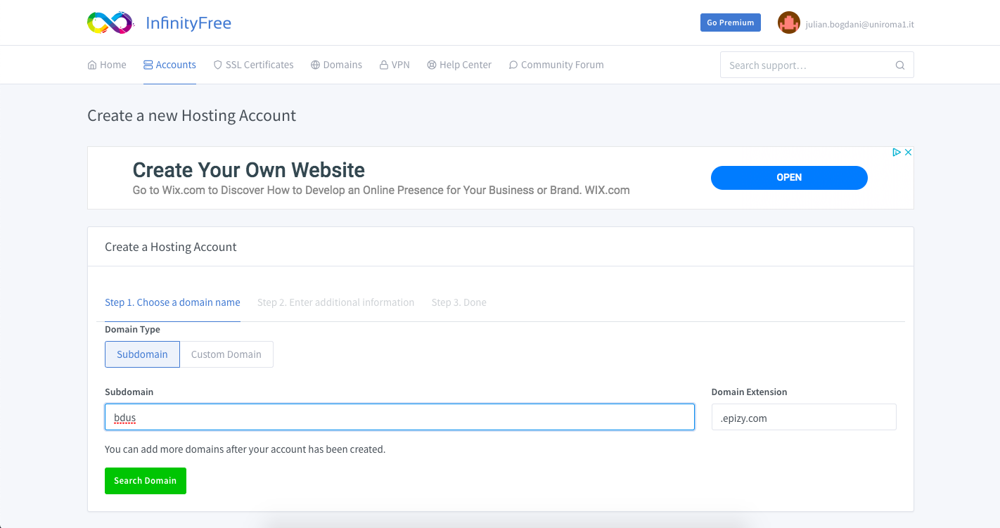
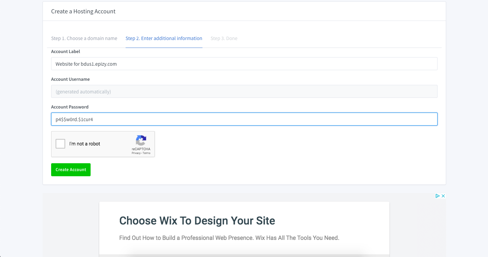
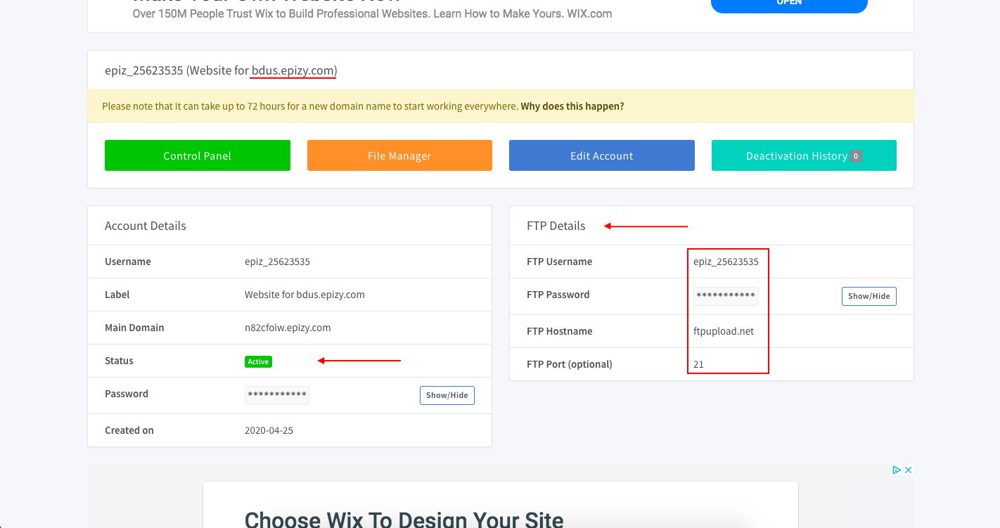

# Creazione del servizio

Per potere caricare in sito è necessario attivare un servizio. 
L'account gratuito permette la creazine di un massimo di tre servizi 
attivi gratuiti.

1. Una volta loggato, nel tab `Accounts` cliccare sul bottone **Create account**

2. Nel campo **Subdomain** inserire il dominio di terzo livello 
dove il servizio verrà pubblicato. Il domini di primo e secondo livello
non sono personalizzabili nella versione gratuita. Si può scegliere tra 
`epizy.com` e tra `rd.gd`. Cliccando si **Search Domain** si avvia una ricerca
per verificare se il sottodominio è disponibile.

3. Successivamente viene chiesto di inserire un etichetta descrittiva per il servizio
che si sta creando (opzionale) e una password sicura che verrà usata per tutte le 
operazioni successive. Lo username verrà generato in maniera automatica.

4. Una volta creato il servizio ci vuole un po' di tempo per la sua pronta
disponibilità nella rete, fino a 72 ore, perché il servisio sia disponibile
all'indirizzo indicato (segnalato nella parte alta della pagina).  
Nella parte sinistra viene indicato lo stato del'applicazione. 
Quando è **Active** significa che possiamo procedere. Quando il servizio si
attiva veniamo avvisati da un mesaggio email. Si tratta di un'attesa di qualche minuto.  
Nella parte destra dela pagina si trovan i dati per il collegamento FTP che 
[useremo con FileZilla](upload-files) per caricare i file nel server remoto. 
La password di _default_ è oscurata; è necessario
cliccare sul bottono **Show/Hide** per visualizzarla.  
Possiamo procedere nel caricamento dei file mentre attendiamo la
[propagazione del DNS](https://infinityfree.net/support/why-doesnt-my-domain-work/).

