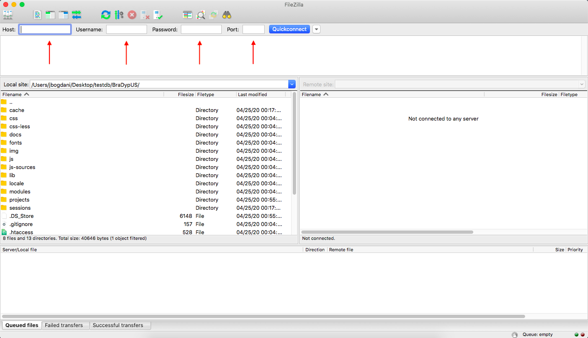
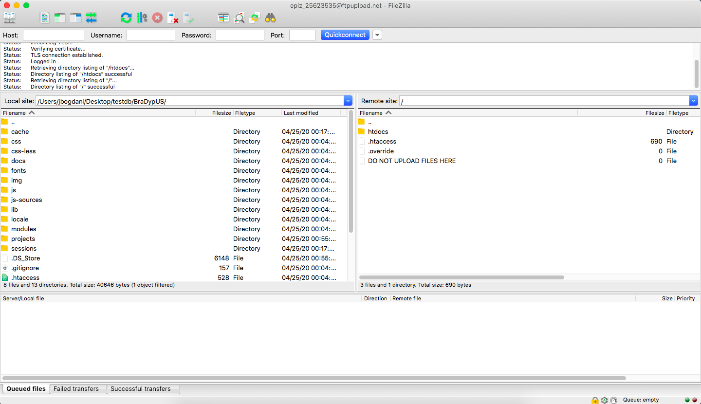
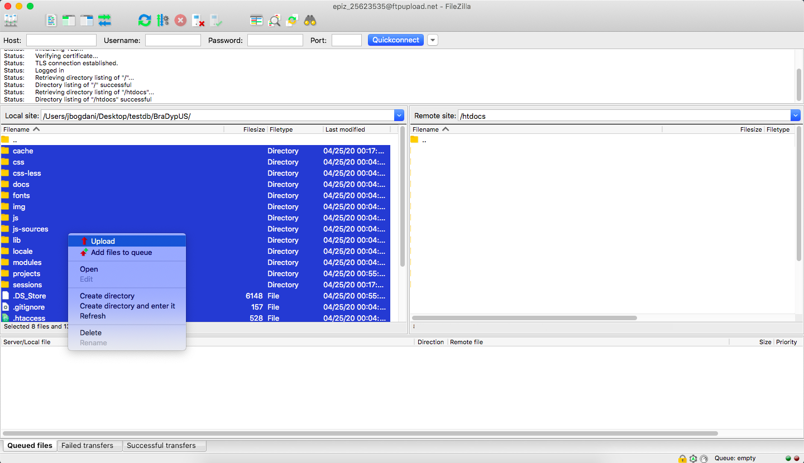
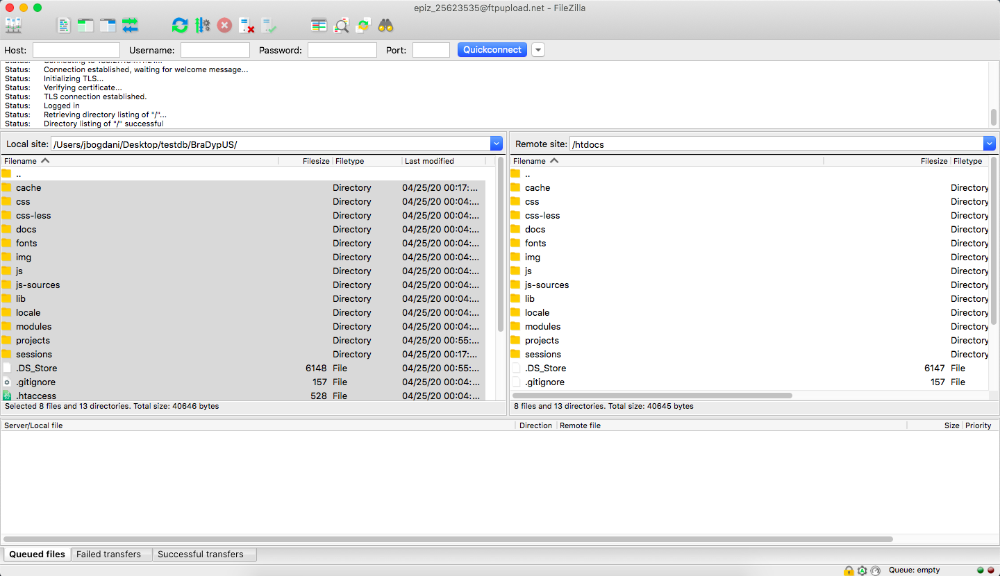
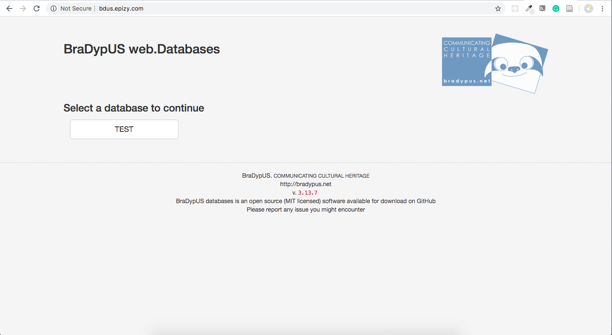

# Creazione del servizio

Per caricare i file nel server verrà usato il protocollo FTP
di cui si è [già detto](../intro).

Il programma più diffuso per la gestione del protocollo FTP è
[FileZilla](https://filezilla-project.org/), un software open-source
disponibile per Windows, MacOS e varie distribuzioni Linux.

Per collegarci ad un server remoto abbiamo bisogno di poche informaizoni:
- Hostname
- Username
- Password
- eventualmente la porta, se diversa dalla porta di default 21.

1. Inseriamo le informazioni di login nella parte alta della finestra e 
clicchiamo su **Quickconnect**.

2. Dopo qualche secondo dovremmo essere connessi e vedere nella parte destra
della finestra il contenuto della cartella remota, mentre in quella sinistra
quella locale.  
Navigo a sinistra fino a collocarmi all'interno della cartella BraDypUS.  
A destra apro la cartella `htdocs` che in molti sistemi è il nome di 
default della cartela web.

3. Seleziono tutti i file e cartelle a sinistra, click destro e **Upload**.  
Partirà in questo momento il processo di caricamento, che in dipendenza della
connessione a disposizione ci da 1 minuto in su. Nella parte bassa dello schermo
sarà possibilie visualizzare la coda in fase di elaborazione.

4. Quando la coda sarà terminata e le due parti dello schermo presentano lo stesso contenuto
il processo di caricamento è terminato.

5. Possiamo andare a questo punto, e se la propagazione dei DNS è terminata, all'indirizzo
prescelto troveremo il nostro database funzionante.  
Ci possiamo loggare nel database **TEST** usando come username `test@bradypus.net` e password: `test`.

**Il nostro database è funzionante e correttamente pubblicato online!**
