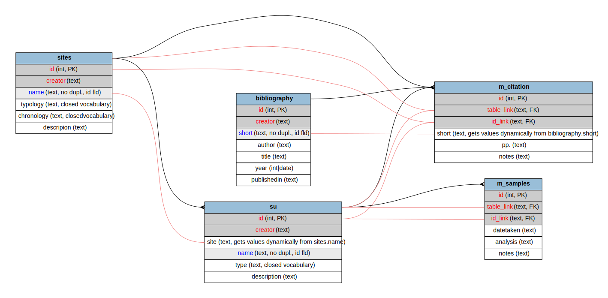

# Structure of the example database

The design of the database strucure is by far the 
the most delicate and important passage and depends
mainy on the data available and on the research aims.

For this tutorial a very simple schema of an archaeological 
database will be used. In its simplicity the schema is sufficiently
articilated to give a glimpse of the main fatures of BraDypUS..

The schema is made of three main tables:
- `sites` contains structured information on archaeological sites
- `su` contains structured information on stratigraphic units, or contexts.  
Each `su` is located in a certain and known site, thus `sites` and `su` 
are linked by a `one-to-many` relationship, ie. one site might have zero, one or more su.
- `bibliography` contains bibliographic records on sites and su.  
`bibliography` is linked in a `many-to-many` relationship with 
both `sites` and `su`. This means that a bibliographic record might contain information for
zero, one or many sites and su and vice-versa, a site might be described 
by zero, one, or meny bibliographic records.  
`many-to-many` relationships are obtained by use of a pivot table.

Finally, we will have the possibility of describing eventually
samples taken from su. Since each su can provide zero, one or many samples,
`su` and `samples` are thus joined in a `one-to-many` relationship.

Yet, samples will not be available as a table on itsown. It will be only
available as an appendinx to su. This appencices tables are called
**plugins** in Bradypus.

Database schema to be built ([open SVG](./../images/design/schema.svg))
