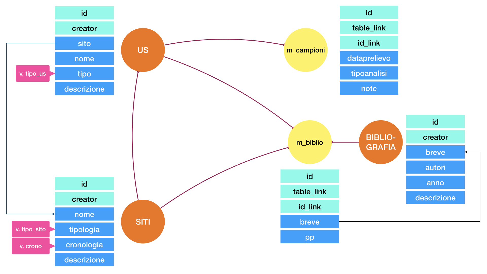

# Schema della banca dei dati

L'elenco delle tabelle e dei campi per ciascuno tabella che si andraà a definite in questa installazione
di test sarà dunque:

## Siti
- nome
- tipologia
- cronologia
- descrizione
- [bibliografia]
    - breve
    - pagine
    - nota

## US
- sito
- nome
- tipo
- descrizione
- [rs]
- [campionamenti]
    - camponione
    - analisi
     -descrizione
- [bibliografia]
    - breve
    - pagine
    - nota

## Bibliografia
- breve
- autori
- anno
- descrizione

---

Questi dati sono tutto quanto ci serve per costruire il nostro database. 
Da questi dati dobbiamo estrarre le informazioni per creare le 
tabelle e le informazioni necessarie per gestire in maniere 
corretta l'interfaccia di **immissione** dei dati e la loro **validazione**.

