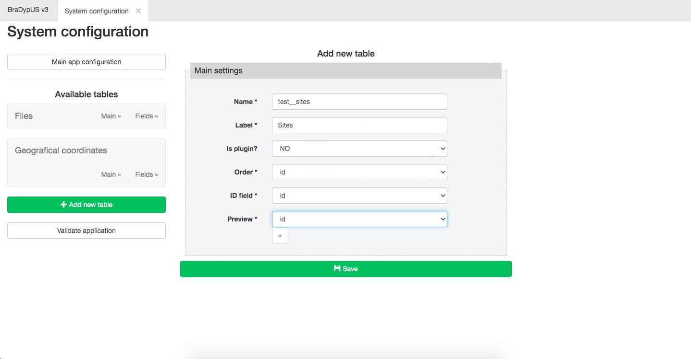
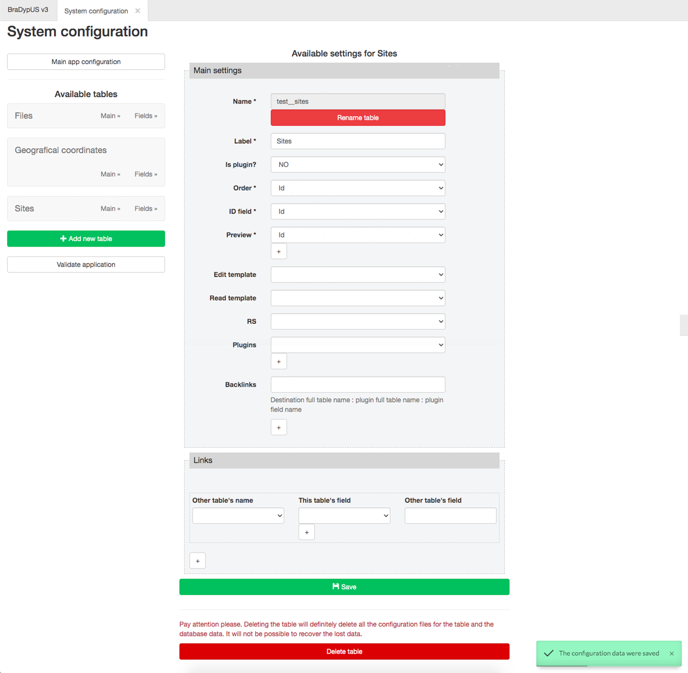

# Creating the first table

The first data table to create is `sites`, or, to quote it with its full name `test__sites`.

Following the main schema tests__sites has the following columns:
- id (int, PK)
- creator (id)
- name (text, no dupl., id fld)
- typology (text, closed vocabulary)
- chronology (text, closed vocabulary)
- description (text)

 
*Test database schema to be built ([open SVG](./../images/design/test-schema.svg))*

Open the **System configuration** module, (enter the super-admin password,) and
click on **Add new table button** on the left side of the window, and fill the
minimal information required for a new table:

- **Name**: the database name of the table with prefix see [Convention for data tables name](/design/conventions#data-tables-name)
- **Label**: The label of the table that will be shown to users
- **Is plugin?**: Enter `Yes` if this is a [plugin table](/design/conventions#data-tables), `No` if it is a [regular table](/design/conventions#data-tables)
- **Order**: The name of the column that will be used for default sorting. Since no columns have been set yet, only `id` is available.
- **ID field**: The name of the column that will be used as the preferred reference for each record. This is a sort of primary key for the users; it can correspond, of course, to the database primary key, i.e. `id`. Since no columns have been set yet, only `id` is available.
- **Preview**: The columns that will be shown in the searche results preview. Since no columns have been set yet, only `id` is available.

 
*Minimal required information to create a new table*

By clicking on the **Save** button, the table settings will be written in the configuration file and the table
will be created in the database. The table edit form will be opened. But before going through the full table
settings it will be better to add the missing columns, and complete the table structure.

 
*Full table settings*

