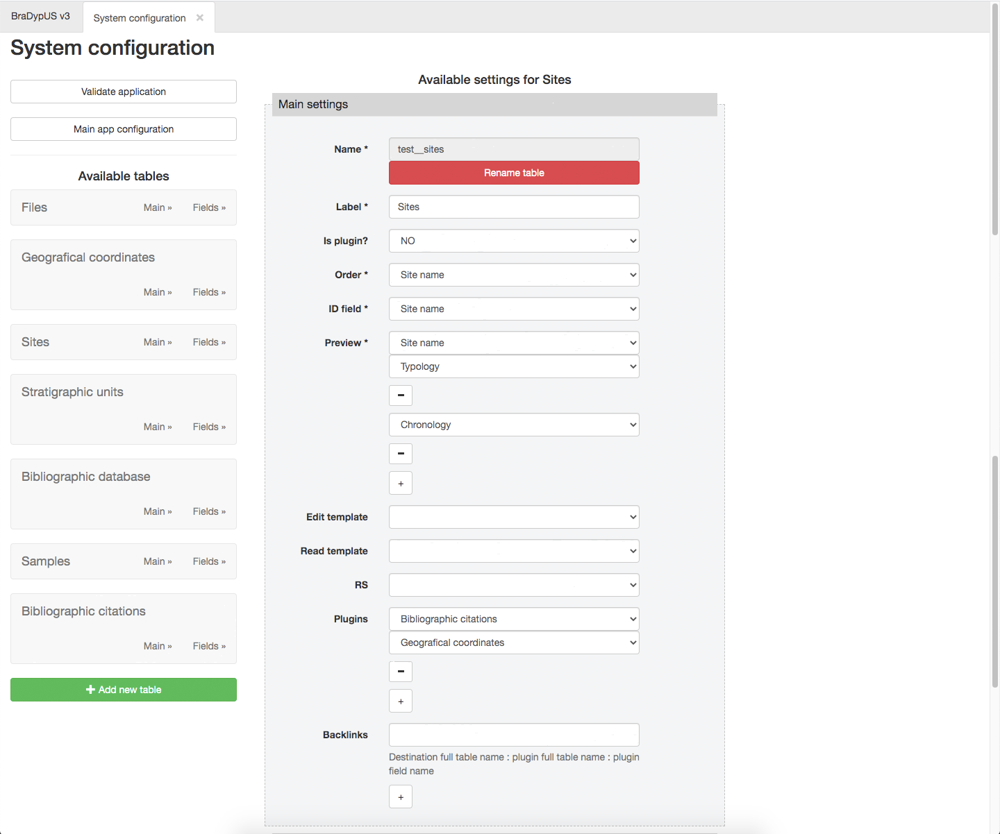
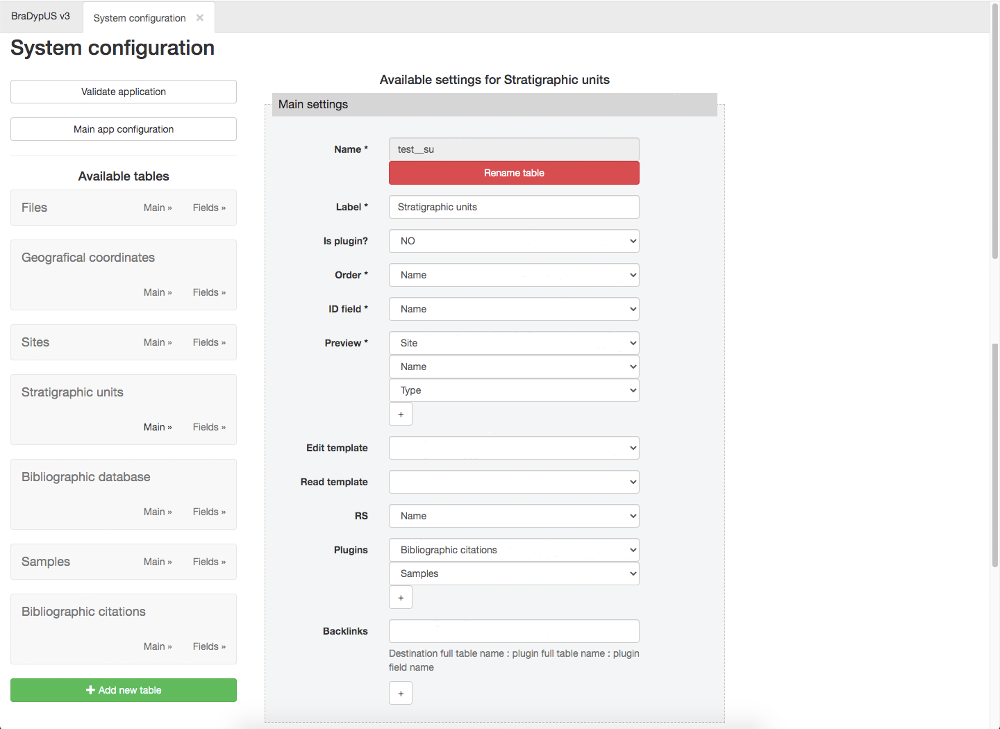
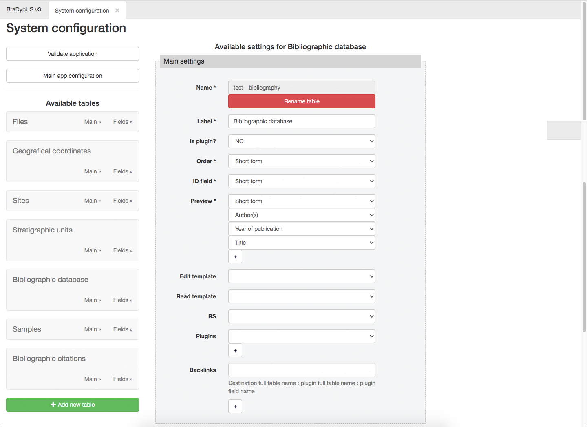
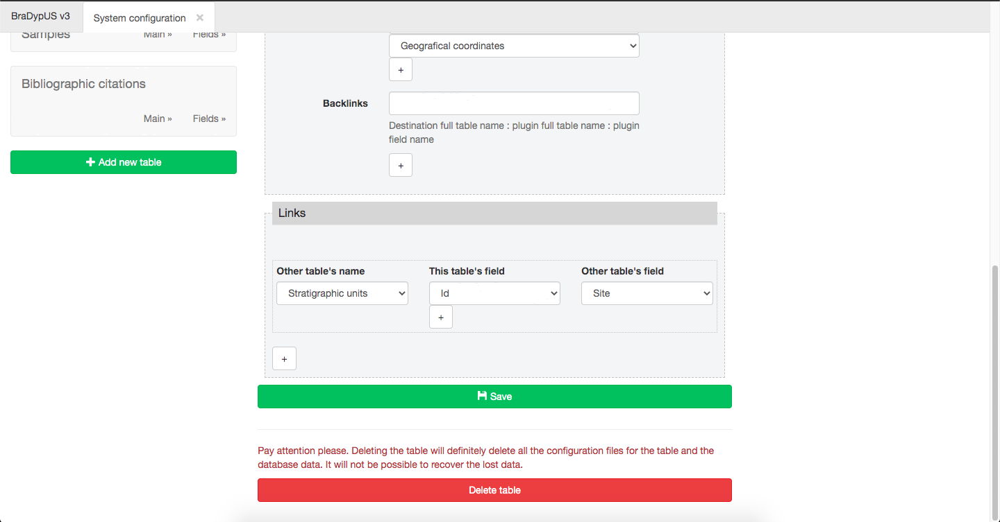
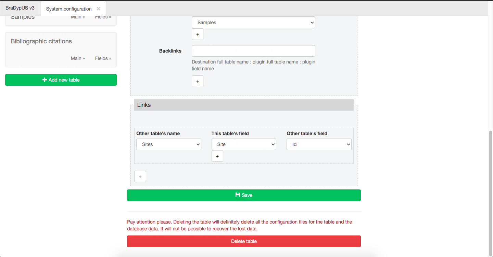

# Finalizing setup

Now that table structure has been completed it is time to finalize the setup, 
by (continuing) editing table properties. We could not do this before, as single fields were missing.

## Table settings

For each data and plugin table the following settings are available:

- **Name**: table name used by the database. It can be changed by clicking on 
the "Rename table" button. Please note that if you change the table name all
settings using table name (links, or field properties) mus be **manually** updated.
- **Label**: The name of the table shown to te user. Can be changed anytime, since this
does not affect the resto of configuration
- **Is plugin?**: yes if this is a plugin table, no, if it is a data table ([for differences click here]((design/conventions#data-tables)).
- **Order**: select the field whose values will be used to sort the records in the query result view
- **ID field**: select the field that will act as user defined identifier (tha database will still use `id` as unique identifier)
- **Preview**: select the fields that will be shown by default in the query result view
- **Edit template**: Select the template (if any) that will be used by default in edit/insert mode
- **Read template**: Select the template (if any) that will be used by default in read mode
- **RS**: If true, the stratigraphical relationship matrix buider and viewer will be activated using the selected field as identifier
- **Plugins**: Select the plugins that will be available for the current table.
- **Backlinks**: Backlinks strategy to use for the table, if any.

 
*Final example of sites table configuration*

 
*Final example of su table configuration*

 
*Final example of bibliography table configuration*

Plugin tables do not require any further update.

## Links between tables

Particular attentions must be paid to the relations between tables.
Data tables and plugins tables are tightly linkes, as seen above, in the table configuration,
by listing, for each tables, the linked plugins.

As you might have noted a plugin might *serve* many tables, as `test__m_citations` does.
It is for thes reason that plugins tables hace a bouble foreing key: `table_link` and `id_link`.

For each tables must be clearly specified the outbound links, for examples Sites nd US are links,
since each Site produces zero, one or manu SU and, the othr way round, each SU is located in one Site.
This one-to-many relation **must** be mapped both in Sites and SU.

Links are added at the bottom of the table properties page, and for each table many 
outbound links might be added.

Each link is defined by a reference to the referred table (**Other table's name**) and by
the names of the fields providing the connection. usually one pair of fields is provided,
but if needed many pairs can be added.

 
*Links of table Sites pointing to table SU*

 
*Links of table SU pointing to table Sites*

