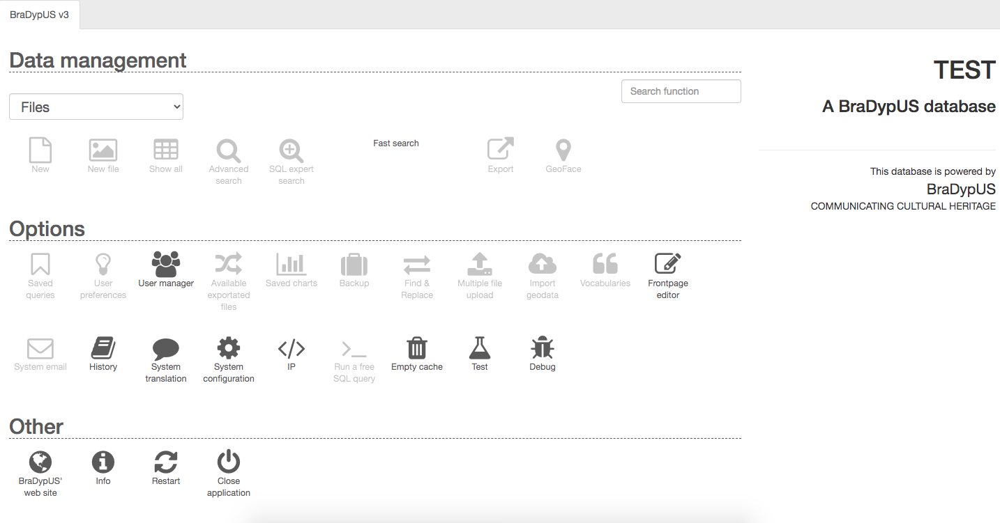
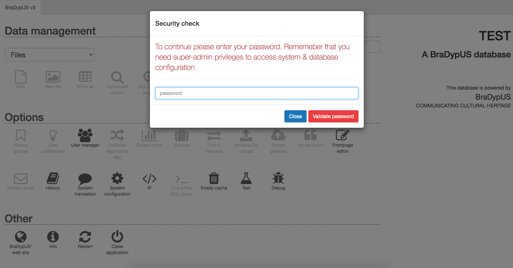
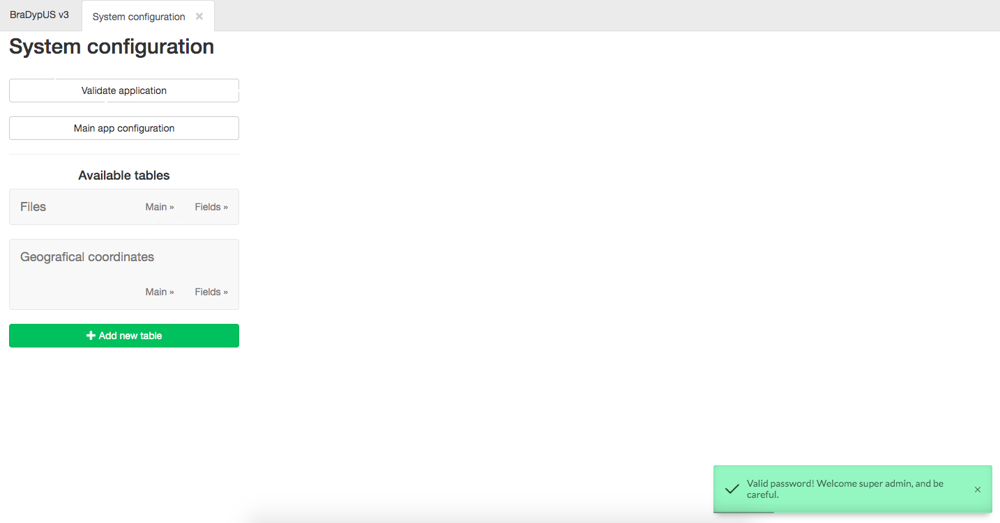
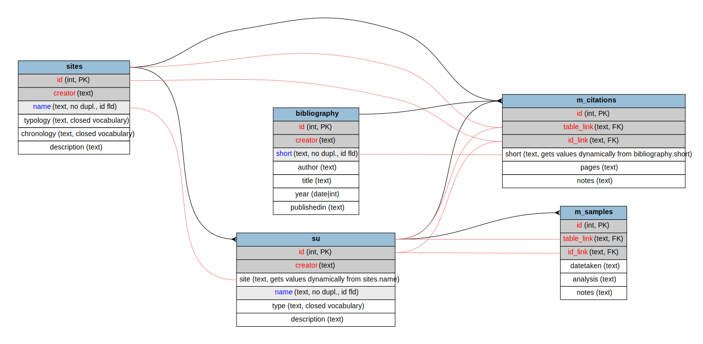

# Setting up the application

Up to now we have downloaded the main software and created the new application,
setting up the database connection, and BraDypUS took care of the rest.

We can now login in the new application, which is almost entirely disabled, because no data tables have been defined yet.

 
*Login after a fresh installation*

We need to enter in the **System configuration** module, where all the configuration
and table structure can be edited.

{: .bg-warning .p-3}
System configuration is a highly dangerous functionality since data tables can be added or removed,
deleting, with no possibility for recover entire datasets.

This is why the super-admin password is required each time the module is opened.

 
*System configuration requires super admin password confirmation*

On the left side are located the main functions, i.e:
- Validate application
- Main app configuration
- Single tables configuration

 
*System configuration module*

It is time now to start building our test database, following the 
already introduced schema:

 
*Test database schema to be built ([open SVG](./../images/design/test-schema.svg))*

