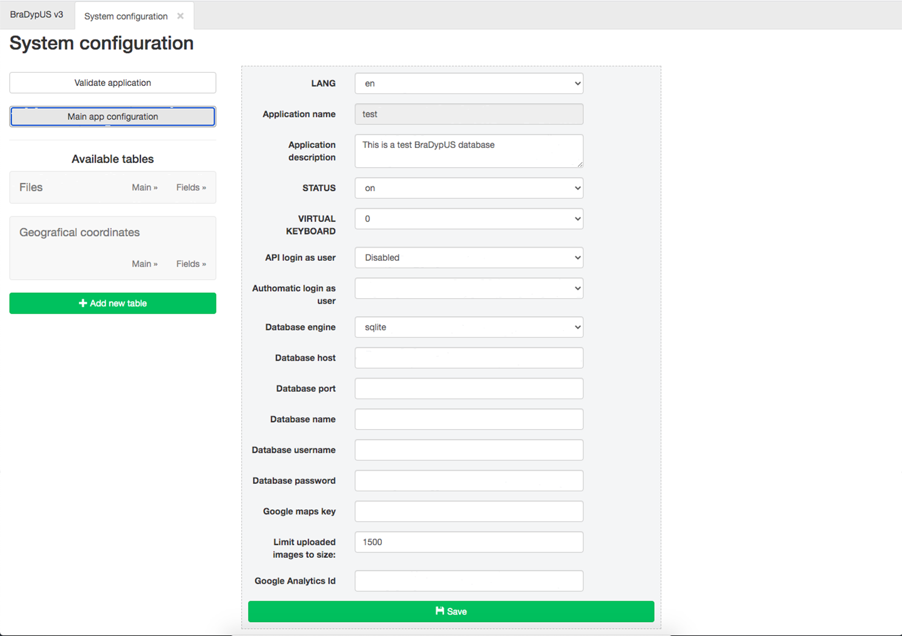

# Main app configuration

The **Main app configuration** permits to expand and update some of the information entered
during the installation process.

 
*Main app configuration*

The following settings are available:

- **LANG**: the system language. At present English and Italian are available, 
but translations are most welcome
- **Application name**: the application name setup up in during the installation process.
This setting **cannot** be changed
- **Application description**: verbose description of the application
- **STATUS**: Application status. `ON`: the application is running and available; `OFF`: the application has been turned off, and only super administrators can enter; `FROZEN`: the application is available in read mode
- **VIRTUAL KEYBOARD**: if true, a virtual keyboard will be provided for textareas.
This feature still needs a full rewrite; do no use until further notice.
- **API login as user**: BraDypUS API logs in the system as a specific user.
The recmomandation is to create a read-only user and enable API with this user.
- **Authomatic login as user**: It is possible to disable user authentication and gve open access to unauthenticated users to the entire dataset. All guest users will be logged as the selected user. The recmomandation is to create a read-only user and enable public access with this user.
- **Database engine**: The daabase engine to use. Currently sqlite (SQLite), mysql (MySQL) and pgsql (PostgreSQL) are supported.
- **Database host**: Host where the database is running, typically 127.0.0.1
- **Database port**: Port number where database listens, typically 3306 for MySQL and 5432 for PostgreSQL
- **Database name**: The name of the database that BraDypUS will use. It is a good choise to name the database after the application name, if possible.
- **Database username**: The username of the database user that BraDypUS will use to connect to the database
- **Database password**: The password of the database user that BraDypUS will use to connect to the database
- **Google maps key**: Google Maps API to use in GeoFace
- **Limit uploaded images to size:**: If set, default is 1500, all uploaded images will be down-sized to meet this limit
- **Google Analytics Id**: Google analytics id, if analytics is available.

