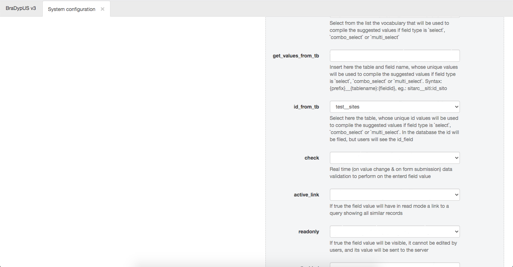

# Creating other data tables

In the same manner, we will create otherdata tables, following the [main schema](/design/).

#### test__su
- id
- creator
- site
    - name: site
    - label: Site
    - type: select
    - db_type: TEXT
- name
    - name: name
    - label: Id
    - type: text
    - db_type: TEXT
    - check: no_dupl
- type
    - name: type
    - label: SU type
    - type: select
    - db_type: TEXT
    - vocabulary_set: create vocabulary sy_type
- description
    - name: description
    - label: Description
    - type: long_text
    - db_type: TEXT

A special mentions deserves `su.site`: this field will contain the reference to the site
where the SU was found and excavated. Logically, any SU is bound to a site, since we do
not excavates layers from unnamed sites. To underline this tight connection we will make sure
we are not permitting users to enter site names for sites that are not yet inserted in the database.

We are going to use `select` as column type but we are not going to use a vocabulary, since we do not
wat to manually update the vocabulary each time  site is inserted or deleted from the database.
We are thus going to use `id_from_tb` as and refere to `test__sites` table.

`id_from_tb` is a very special feature, and can be described as a foreign key. In the database
will be entered the id value of the referred record in the other database, while to the
user will be shown the value of the coresponding ID field. This permits to obtain a strict connection
between tables, without renouncing to the "human readable" identifiers, which might be different
from the database ones.

 
*Usage of id_from_tb*

#### test__bibliography
- id
- creator
- short
    - name: short
    - label: Short form
    - type: text
    - db_type: TEXT
    - check: no_dupl
- author
    - name: author
    - label: Author(s)
    - type: text
    - db_type: TEXT
- title
    - name: title
    - label: Title
    - type: text
    - db_type: TEXT
- year
    - name: year
    - label: Year of pubblication
    - type: text
    - db_type: TEXT
- publishedin
    - name: publishedin
    - label: Published in
    - type: text
    - db_type: TEXT

#### test__m_samples
- id
- table_link
- id_link
- datetaken
    - name: datetaken
    - label: date taken
    - type: date
    - db_type: TEXT
- analysis
    - name: analysis
    - label: Analysis
    - type: text
    - db_type: TEXT
- notes
    - name: notes
    - label: Notes
    - type: long_text

#### test__m_citations
- id
- table_link
- id_link
- short
    - name: short
    - label: Short
    - type: select
    - db_type: TEXT
    - id_from_tb: test__bibliography
- pages
    - name: pages
    - label: Pages
    - type: text
    - db_type: TEXT
- notes
    - name: notes
    - label: Notes
    - type: long_text
