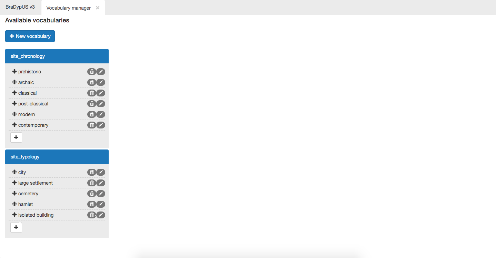
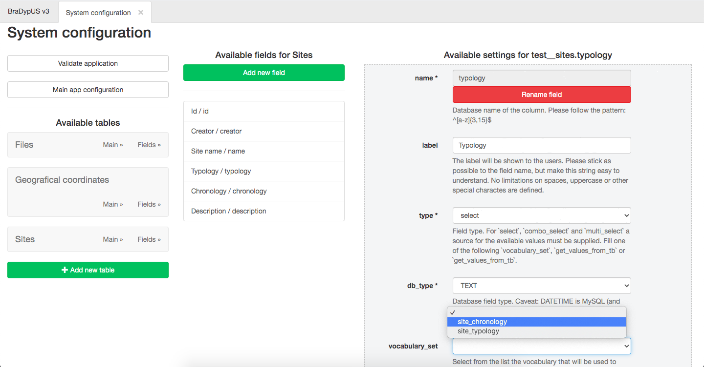

# Managing vocabularies

BDUS has a built-in functionality to easily define and edit vocabularies, 
i.e. list of values to link with `select`, `combo_select` and 
`multi_select` [field types](/setup/adding-columns#type).

Vocabularies management require admin or super-admin privileges,
since their definition heavily influences the data entry process.

{: .bg-info .p-2 .text-white}
Vocaburaies are loosely binded to fields, i.e. they provide/suggest/limit to values
but changes to vocavulary items **will not propagate** to the database. You need to
search/replace for single instances of usage of each term if you want to update.

---

On a fresh installation no vocabolary is defined, and to create a new one click on 
**New vocabulary** button in the Vocabulary manager module.

For the test application, we need two vocabularies, linked to column sites.typology
and to column sites.chronology. Will populate these vocabularies with simple values:
- site_typology
    - city
    - large settlement
    - cemetery
    - hamlet
    - isolated building
- site_chronology
    - prehistoric
    - archaic
    - classical
    - post-classical
    - modern
    - contemporary

To create a new vocabury, type the name of the vocabolary and press Enter and 
then type the value of the first item and click on **Add**.

") 
*Adding a new vocabulary (item)*

Creating the first item will create also the relative vocabulary. It is then the possible to 
add new item easily.

Once enterd vocabulary items can be re-ordered by simply dragging and dropping single items, 
edited by clicking on the penci icon or deleted by clicking in the trash bin icon.

 
*Vocabulary list*

Once one ore more vocabularies are set, they will appear in the drop-down list
of field properties, and thus linkk to single fields.

 
*Linking field to vocabulary*
