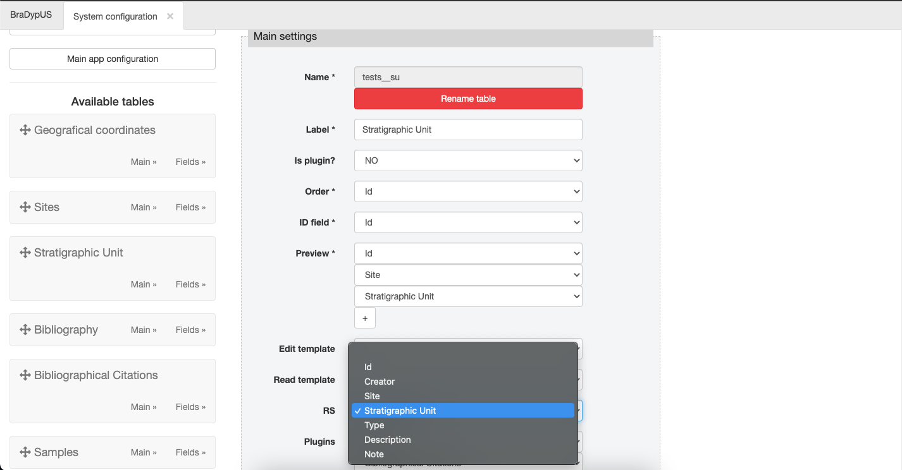
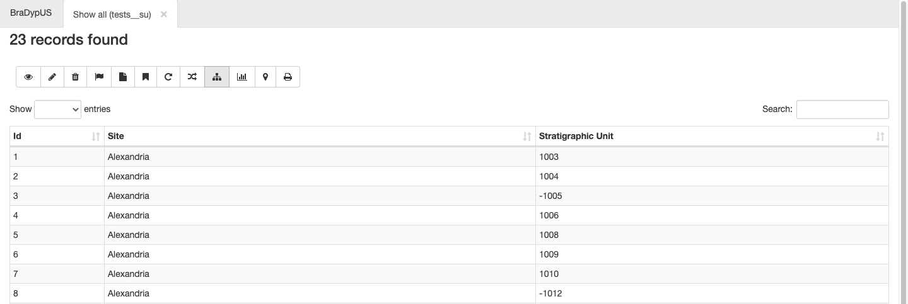
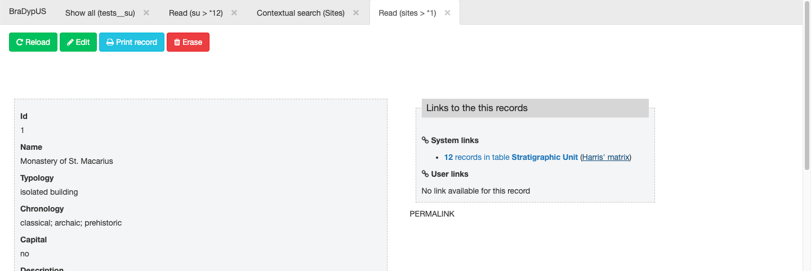

Bradypus has built-in support for stratigraphical relationships management
and the automatic construction of the [Harris Matrix diagram](https://en.wikipedia.org/wiki/Harris_matrix).

The function can be activated for one or more tables, from the **System Configuration**,
by accessing the **Main settings** of each table. The setting is called `rs` (which is Italian *relazioni stratigrafiche*).

From the drop-down menu chooes the column that contains the name of the context/stratum:

 
*Activate Stratigraphical relationships*

After the plugin has been activated, the plugin GUI will appear in the edit mode of each record.

**Pay attention #1**: the plugin will not be available on adding a new record form; it will appear only 
after the recprd has been created and opened in edit mode.

**Pay attention #2**: if you are using custom templates, you should explicitly add the plugin to the
template, by adding ```print.rs```

Relationships can be easily added by choosing from the drop-down menu the type of physical relationship 
between the two contextes and by adding manually the name of the second context, the first being the
currently opened.

One a relatioship is added it can be easily deletec by clicking on the `[x]` near each context name.

 
*Editing stratigraphical relationships*

**Pay attention**: the relation between two contextes, eg. `10` and `11` can be defined only once
and the system will throw an error if you try to add it again. If is not important if the relationship
between `10` and `11` is added by editing the record of `10` or thato of `11`. It will allways appear in 
both records. You can not edit a previously added relation. To change the relationship value, delete
the relationship and add it again.

### Graphical representation
One the relationships are aded you can automatically build a graphica representation of the Harris matrix.

In the results toolbar click on the matrix button: 

 
*Viewing the matrix*

A dynamic graph will appear; you can zoom and pan it anc click on each node and the corresponding context 
records will be opened in read mode.

A link to a dynamic Harris Matrix will appear also in the **System links**, 
if the plugin has been activated for the destionation table:

 
*Viewing the matrix*
