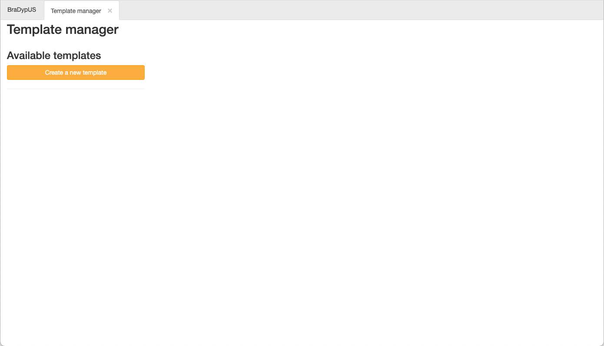
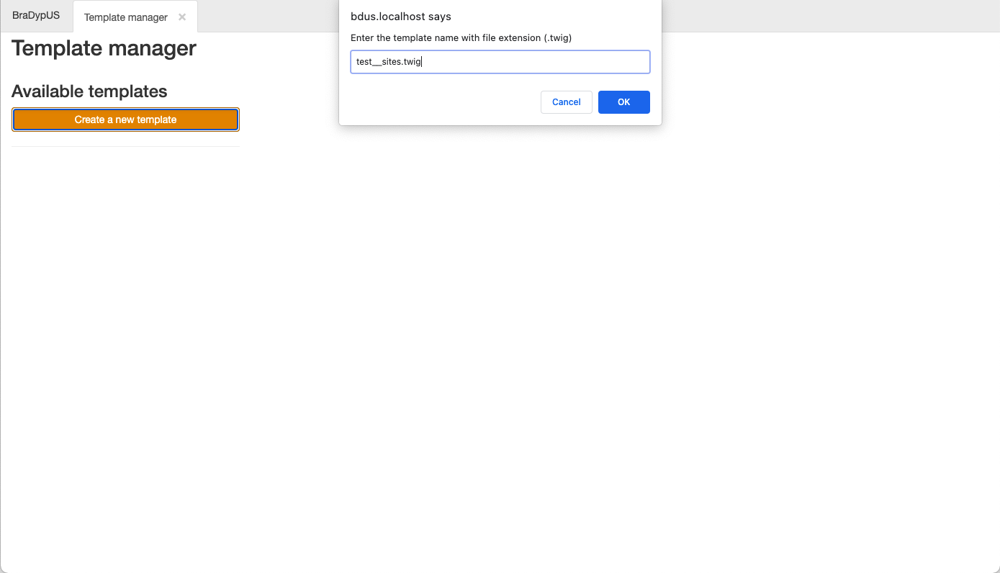
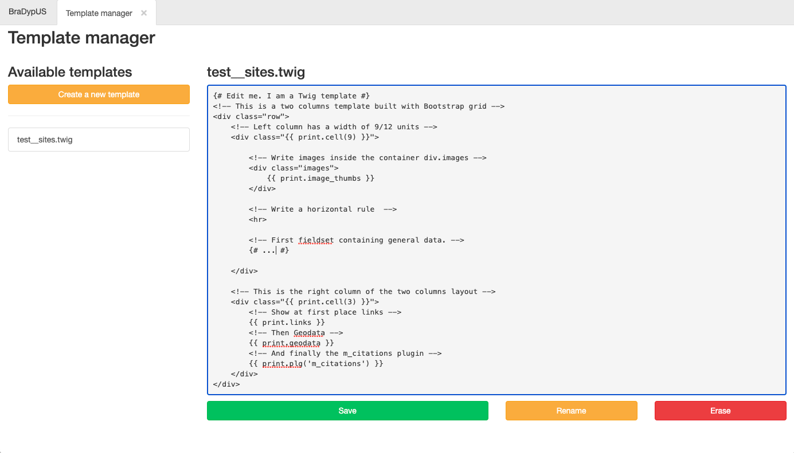

BraDypUS uses [Twig](https://twig.symfony.com/) as a PHP template
engine system-wide. Twig is used to write templates, as well.

Typically, you do not really need a deep knowledge of PHP or Twig
to write a template file; in fact you do not need *any*
knowledge of PHP or Twig to create a template.

What you really need is:
- (very) good knowledge of [HTML](https://en.wikipedia.org/wiki/HTML5)
- (very) good knowledge of [Boostrap](https://getbootstrap.com/)  
The usage of Bootstrap is not mandatory, but it can really help,
and Bootstrap is already available in the core of BraDypUS.
- a very good knowledge of the `print` object made available by 
BraDypUS.

{: .callout-block .callout-block-success }
Since version 4.1.0 (2021-06-24) templates can be written 
inside Bradypus, using GUI tool named **Template manager**

## Template manager

Template manager is used to create and edit templates. In a newly 
created app it is typically empty and the only option to create a 
new template is available.

 
*Template manager on a new app*

By clicking on the **Create a new template** button, a 
promt will appear that can be used to insert the template name. 
Template files **must** have `.twig` extension and will 
be saved automatically in the template folder of the 
project, in the test case: `projects/test/templates/`

 
*Create a new template file*

After the name of the file is entered, the new and empty 
template file is available in the left side of th screen.
As soon as new templates are added, these will be alphabetically listed here:

 
*New template file created*

You can name your template files whatever you like, but it is 
recommended to choose a significatve name, possibly containing 
also a reference to te data-table they refer.

{: .callout-block .callout-block-info }
Templates named exactly after the the referenced data-table
without prefix, eg. `sites.twig` or `su.twig` will be
**automatically** loaded by the system for these tables.
The same can be said for context-related template names,
such as `sites_edit.twig` or `sites_read.twig`.

 
*Add content to the template file*

By clicking on the template name, it's content will be shown
on the right part of the screen. The text is editable
and HTML and Twig can be written. Database data will be injected
into the template file on real time, and the 
[`print` object](print-object) can be used to refer to these data.

**Save** button will write the edits to the file, **Rename** can be
used to rename the template file, and finally **Erase** will
permanently delete the file from the disc.
