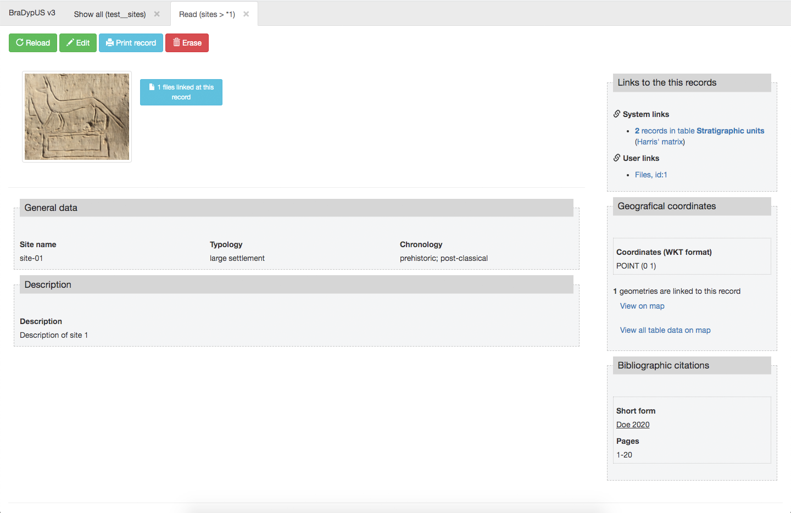
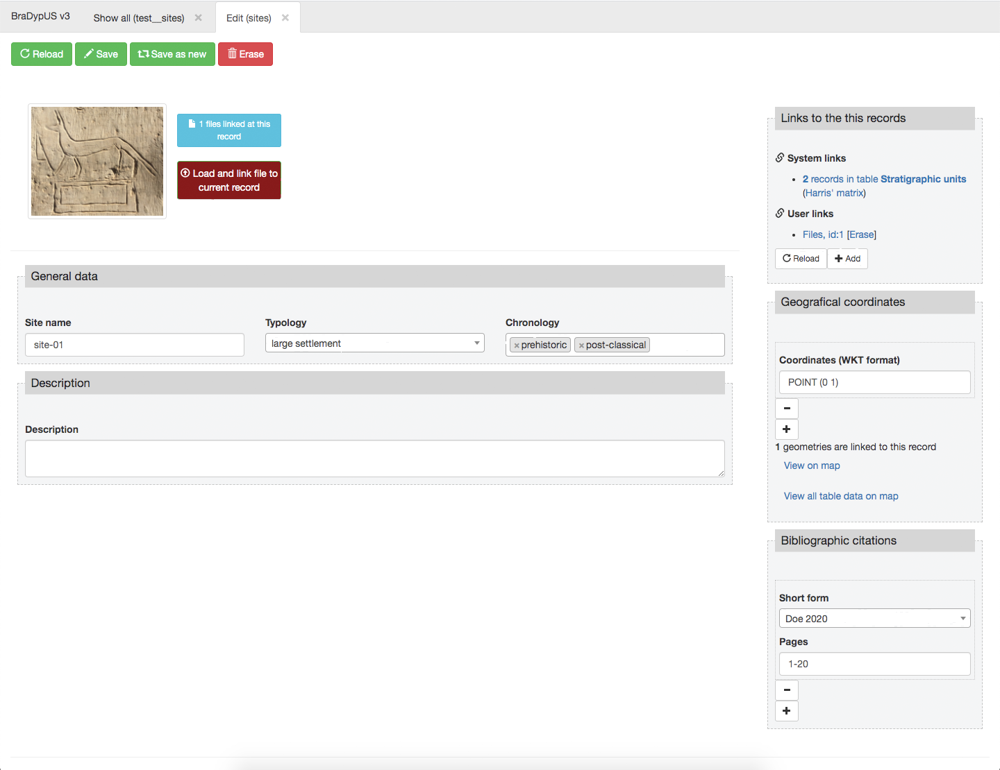

Follows a working examplte template of table test__sites


```html
<!-- This is a two columns template built with Bootstrap grid -->
<div class="row">
    <!-- Left column has a width of 9/12 units -->
    <div class="{{ print.cell(9) }}">

        <!-- Write images inside the container div.images -->
        <div class="images">
            {{ print.image_thumbs }}
        </div>

        <!-- Write a horizontal rule  -->
        <hr>

        <!-- First fieldset containing general data. -->
        <fieldset>
            <legend>General data</legend>
            <!-- name, typology and chronoogy will be in the same row and will have equal width (4/12 units) -->
            <div class="row">
                <div class="{{ print.cell(4) }}">
                    {{ print.fld('name') }}
                </div>
                <div class="{{ print.cell(4) }}">
                    {{ print.fld('typology') }}
                </div>
                <div class="{{ print.cell(4) }}">
                    {{ print.fld('chronology') }}
                </div>
            </div>
        </fieldset>

        <!-- A second fieldset contains only description -->
        <fieldset>
            <legend>Description</legend>
            <div class="row">
                <div class="{{ print.cell(12) }}">
                    {{ print.fld('description') }}
                </div>
            </div>
        </fieldset>
    </div>

    <!-- This is the right column of the two columns layout -->
    <div class="{{ print.cell(3) }}">
        <!-- Show at first place links -->
        {{ print.links }}
        <!-- Then Geodata -->
        {{ print.geodata }}
        <!-- And finally the m_citations plugin -->
        {{ print.plg('m_citations') }}
    </div>
</div>
```



 
*Output, in read context, of the above template*

 
*Output, in edit context, of the above template*
